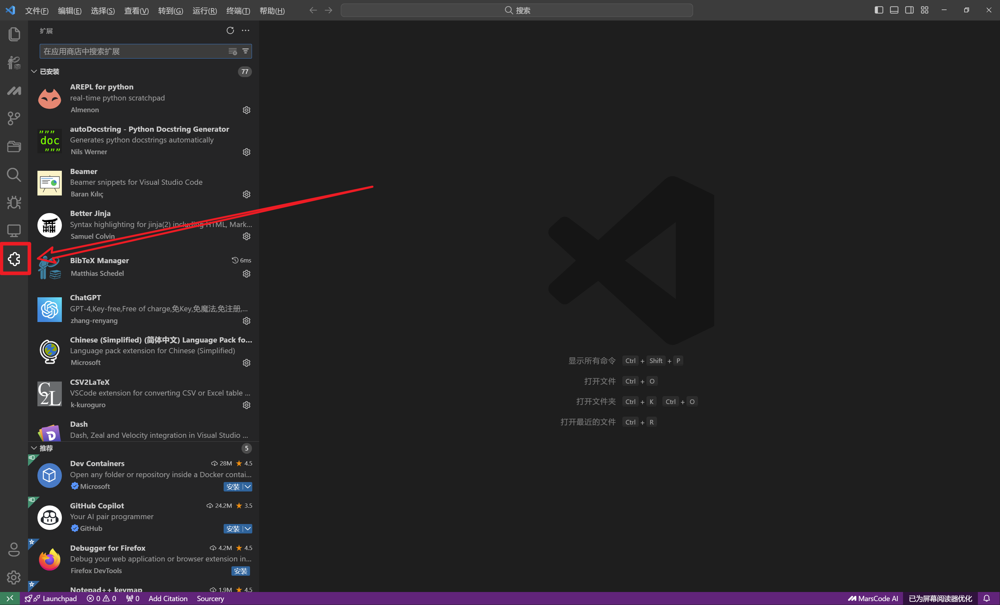
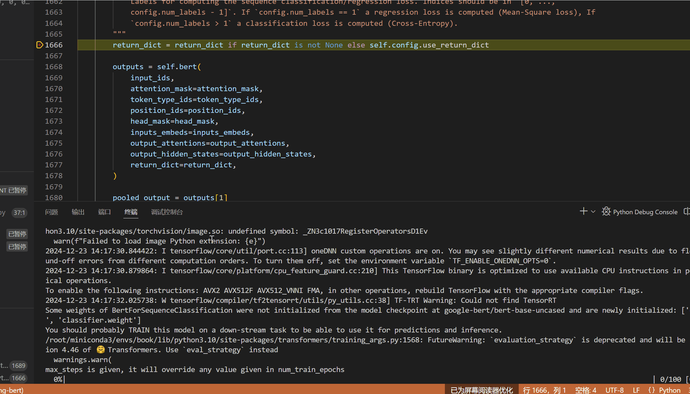

# Transformer本地Debug环境配置教程

# 0. 准备工作

## Windows

为了统一后续操作，我们在Windows系统中安装WSL（Windows Subsystem for Linux），使得我们可以在windows中使用linux子系统。

1. 打开“控制面板”，在右上角搜索“启用或关闭Windows功能”
2. 点击进入“启用或关闭Windows功能”，勾选“Hyper-V”、“Windows虚拟机监控程序平台”、“适用于Linux的Windows子系统”、“虚拟机平台”，确定后重启电脑
3. 按下win+X，选择“Windows Powershell（管理员）”，然后在powershell中运行：
    
    ```powershell
    wsl --update
    wsl --shutdown
    ```
    
4. 打开Microsoft商店，安装Ubuntu22.04
5. 按下win+R，输入”wsl”，启动Ubuntu子系统的shell终端，设置默认用户名和密码
6. 更换apt镜像（换源），从而使用apt命令下载包时更快
    1. 按下win+E打开资源管理器，在地址栏输入”\\wsl.localhost\Ubuntu\etc\apt”
    2. 将sources.list文件复制为source.llist.bak作为备份
    3. 修改sources.list文件为如下内容：
        
        ```
        
        deb http://mirrors.tuna.tsinghua.edu.cn/ubuntu/ focal main restricted universe multiverse
        deb http://mirrors.tuna.tsinghua.edu.cn/ubuntu/ focal-updates main restricted universe multiverse
        deb http://mirrors.tuna.tsinghua.edu.cn/ubuntu/ focal-backports main restricted universe multiverse
        deb http://mirrors.tuna.tsinghua.edu.cn/ubuntu/ focal-security main restricted universe multiverse
        ```
        
    4. 更新apt配置，并升级apt软件包
        
        ```bash
        sudo apt update
        sudo apt upgrade
        ```
        

## MacOS

1. 打开“终端”，执行以下命令以安装brew
    
    ```bash
    # 或者把/bin/bash换成/bin/zsh
    /bin/bash -c "$(curl -fsSL https://gitee.com/cunkai/HomebrewCN/raw/master/Homebrew.sh)"
    ```
    
2. 使用brew安装wget
    
    ```bash
    brew install wget
    ```
    

## Linux (Ubuntu)

1. 更换apt镜像
    1. 将/etc/apt/sources.list复制备份为/etc/apt/sources.list.bak
    2. 修改/etc/apt/sources.list中内容为如下内容
        
        ```
        
        deb http://mirrors.tuna.tsinghua.edu.cn/ubuntu/ focal main restricted universe multiverse
        deb http://mirrors.tuna.tsinghua.edu.cn/ubuntu/ focal-updates main restricted universe multiverse
        deb http://mirrors.tuna.tsinghua.edu.cn/ubuntu/ focal-backports main restricted universe multiverse
        deb http://mirrors.tuna.tsinghua.edu.cn/ubuntu/ focal-security main restricted universe multiverse
        ```
        
    3. 更新apt配置，并升级apt软件包
        
        ```bash
        sudo apt update
        sudo apt upgrade
        ```
        

# 1. 安装Conda和Python环境

**⚠建议不要使用其他方法安装Conda和Python，作者替大家踩过坑了**

下面提到“终端”时，指的是：

- Windows中的“Ubuntu子系统终端”（win+R输入”wsl”后弹出的终端）
- MacOS中的“终端/Terminal”
- Linux中的“终端/Terminal”

安装Conda和Python环境的步骤如下

1. 在“终端”中执行以下命令，下载Miniconda的安装包：
    
    ```bash
    wget https://mirrors.tuna.tsinghua.edu.cn/anaconda/miniconda/Miniconda3-py310_24.1.2-0-Linux-x86_64.sh
    ```
    
2. 执行以下命令，安装Miniconda. 该命令执行后会让你阅读相关协议条款，请一直按住回车，直至条款输出完毕后，会弹出提示让你输入”yes/no”，输入”yes”表示同意条款并安装
    
    ```bash
    # mac上可能把bash换成zsh
    bash Miniconda3-py310_24.1.2-0-Linux-x86_64.sh
    ```
    
3. 重启“终端”，执行下列命令更新conda和pip:
    
    ```bash
    conda update conda
    conda update pip
    ```
    
4. 更换pip镜像
    
    ```bash
    pip config set global.index-url https://pypi.tuna.tsinghua.edu.cn/simple
    ```
    

# 2. 安装和配置Visual Studio Code

1. 在[vscode官网](https://code.visualstudio.com/)下载并安装vscode
2. 启动vscode，vscode界面的最左侧有一系列图标，找到“扩展（Extension）”（图标样子可能不一样，一般是拼图或者是像俄罗斯方块的东西，一个个试一下）
    
    
    
3. 搜索并安装”Python”扩展。如果是windows系统，还需要安装”WSL”扩展
    
    
    

# 3. 新建项目并运行代码

1. (仅Windows系统需要) 点击右下角的绿色小按钮，在弹出来的菜单中选择“连接到WSL环境”
    
    
    
    
    
2. 按ctrl+`（`在数字1左边）唤出vscode中的终端，这个终端就是我们之前所提到的终端，只是它被集成到了vscode中，更加方便
3. 在终端中执行以下命令，创建名为”fine-tuning-bert”的项目目录，并进入目录：
    
    ```bash
    mkdir fine-tuning-bert
    cd fine-tuning-bert
    ```
    
4. 使用pwd命令查看项目目录的绝对路径，把绝对路径复制下来：
    
    ```bash
    pwd
    ```
    
5. 在vscode界面的左上角点击“文件”→”打开文件夹”，在弹出来的窗口中输入刚才复制的路径，回车
6. 新建一个文件，命名为”fine_tune_bert.py”:
    
    
    
7. 粘贴以下代码到”fine_tune_bert.py”文件中
    
    ```python
    import os
    
    os.environ["HF_ENDPOINT"] = "https://hf-mirror.com"
    
    from datasets import load_dataset
    from transformers import BertForSequenceClassification
    from transformers import BertTokenizer
    from transformers import Trainer, TrainingArguments
    
    train_dataset = load_dataset("nyu-mll/glue", "sst2", split="train[:1000]")
    eval_dataset = load_dataset("nyu-mll/glue", "sst2", split="validation")
    
    model = BertForSequenceClassification.from_pretrained("google-bert/bert-base-uncased")
    
    tokenizer = BertTokenizer.from_pretrained("google-bert/bert-base-uncased")
    
    def process_data(example):
        return tokenizer(example["sentence"], padding="max_length", truncation=True)
    
    train_dataset_proc = train_dataset.map(process_data)
    eval_dataset_proc = eval_dataset.map(process_data)
    
    trainer = Trainer(
        model,
        args=TrainingArguments(
          output_dir="./output_dir",
          report_to="none",
          max_steps=100,
          evaluation_strategy="steps",
          eval_steps=20,
          save_steps=20,
        ),
        train_dataset=train_dataset_proc,
        eval_dataset=eval_dataset_proc,
    )
    trainer.train()
    ```
    
8. 点击左下角“选择解释器”，如果左下角没有这个选项，应该也会显示一个形如”3.x.y”的python版本号，同样点击它即可。
    
    
    
9. 在“选择解释器”的弹窗中选择miniconda的base环境
    
    
    
10. 按ctrl+`唤起终端，此时可以看到，终端处于当前项目路径下，并已自动激活所选python解释器所在的base环境
    
    
    
11. 在终端中安装python包
    
    我们的项目需要用到torch, transformers和datasets三个包。之前在colab中，我们在代码块中安装包的方法如下：
    
    ```python
    !pip install transformers
    ```
    
    在Colab或者说Jupyter Notebook中使用”!”前缀，说明”!”后面的内容需要在终端中执行。现在我们不使用colab，而是改用”.py”的python文件来编写我们的微调代码，因此，我们需要直接在终端中执行包安装命令：
    
    ```bash
    pip install torch transformers datasets
    ```
    
    这些包会被安装到你目前所处的conda环境（base）中
    
12. 在终端运行python程序，微调bert模型
    
    ```bash
    python fine_tune_bert.py
    ```
    
    整个代码运行完可能需要2-3分钟。可以在vscode的资源管理器（文件目录）中看到，该程序输出了一个output_dir目录，里面会保存微调后的bert模型。
    

# 4. Debug配置

“fine_tune_bert.py”的代码构建了一个Trainer，把模型和数据输入给了Trainer，然后调用Trainer.train方法训练模型。

但是，我们不了解Trainer里面发生了什么，特别是：

- “喂”给模型的数据格式正确吗？或者说我们在”fine_tune_bert.py”中是否把数据处理成了模型所期望的格式？
- 模型输出了什么？模型的输出是如何与“喂”进来的标签计算loss的？

因此，很多时候，我们需要通过Debug来观察数据在模型中流动的全过程。

利用vscode进行python代码Debug的规范流程如下：

1. 进入vscode的debug选项卡，点击“创建launch.json”文件
    
    
    
2. 在弹窗中选择”Python Debugger”→”Python文件”
    
    
    
    
    
3. 此时在代码编辑区域会弹出来一个”launch.json”文件，并且左下角还有一个“添加配置…”按钮
    
    
    
4. 点击“添加配置…”，在接下来出现的弹窗中依次选择“Python: 调试程序”→”Python文件”
    
    
    
    
    
5. 此时”launch.json”的”configurations”中会多出来一项配置，按照如下方式修改：
”name”改为自己喜欢的名字即可；”program”改为所需debug的代码的文件名；”justMyCode”设为false，使debug程序可以进到非本项目的代码中：
    
    
    
6. 编辑好后保存”launch.json”文件，并在debug选项卡中选择刚才新增的配置：
    
    
    
7. 回到”fine_tune_bert.py”代码的编辑界面，找到第14行，按住ctrl (Mac按住command)，把鼠标挪到BertForSequenceClassification上，可以看到，这个类名变成了一个可点击的链接，点击后可以跳转到这个类的定义：
    
    
    
8. 上一步点击后跳转到了modeling_bert.py文件中的BertForSequenceClassification类，找到这个类的forward方法（在第几行不确定，不同transformers包的版本不一样）：
    
    
    
9. 把鼠标挪到代码行号左边的区域，在forward方法的第一行打上断点：
    
    
    
10. 在debug选项卡中启动Fine-tuning BERT的debug配置，等待断点触发：
    
    
    
11. 断点触发后，在调试控制台可以查看变量的值：
    
    
    
    可以在调试控制台运行任何python代码